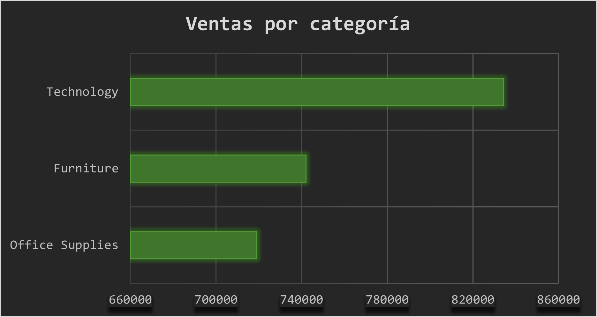
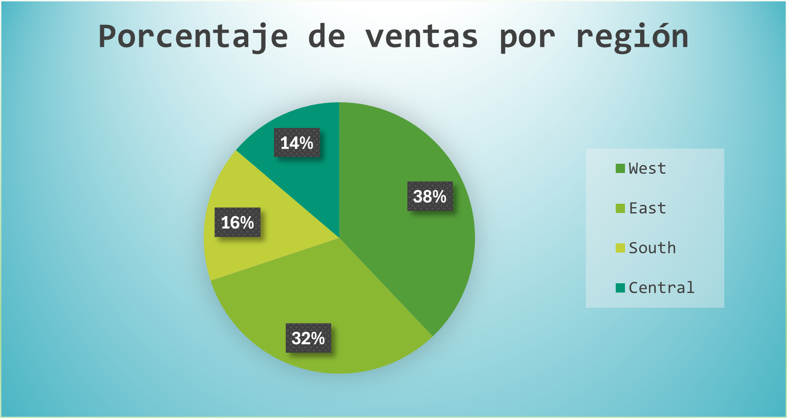
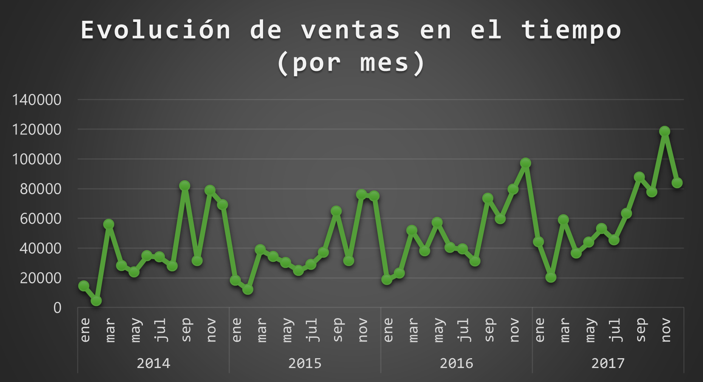

#📊 Superstore Sales Analysis

**Autor:** Morena Figueroa  
**Herramientas utilizadas:** Excel  
**Fecha:** Junio 2025  

---

##🎯 Objetivo del análisis

Analizar las ventas, ganancias y comportamiento de clientes en una tienda minorista ficticia para identificar patrones, subcategorías no rentables y oportunidades de mejora.

---

##🧪 Proceso de análisis

- Limpieza y revisión del dataset (fechas, valores nulos, formatos).
- Cálculo de métricas clave usando fórmulas (ventas totales, ganancias, top categorías).
- Uso de **tablas dinámicas** para segmentar por región, categoría y subcategoría.
- Visualización de datos con **gráficos dinámicos** (línea, barra apilada).
- Redacción de insights accionables.

---

##📈 Visualizaciones

### Ventas por Categoría

---

### Ventas por Región

---

### Evolución mensual de las Ventas

##🧠 Insights clave

- 💰 **Tecnología representa el 35% de las ventas totales**, siendo la categoría más rentable.
- 🪑 **Las Tables (mesas) generan pérdidas importantes**, lo que sugiere revisar precios o logística.
- 🌎 **La región West es la más rentable**, mientras que South tiene márgenes bajos.
- 📅 **Los ingresos aumentan en el último trimestre del año**, posiblemente por estacionalidad.
- 🎯 Recomendación: revisar la rentabilidad por subcategoría, priorizar campañas en regiones más rentables y optimizar costos en productos deficitarios.

---

##📁 Archivos del proyecto

- `superstore_sales_analysis.xlsx`: archivo con las fórmulas, análisis y gráficos.
- `/screenshots/`: carpeta con capturas de los dashboards y gráficos.

---

##🔗 Dataset original

[Superstore Dataset en Kaggle](https://www.kaggle.com/datasets/vivek468/superstore-dataset-final)

---

##💬 Contacto

📧 morenafigueroa.a@gmail.com  
🔗 [LinkedIn](https://www.linkedin.com/in/weneedmoretranslations/)

---

> Este proyecto fue realizado con fines educativos como parte de mi portfolio de análisis de datos.
